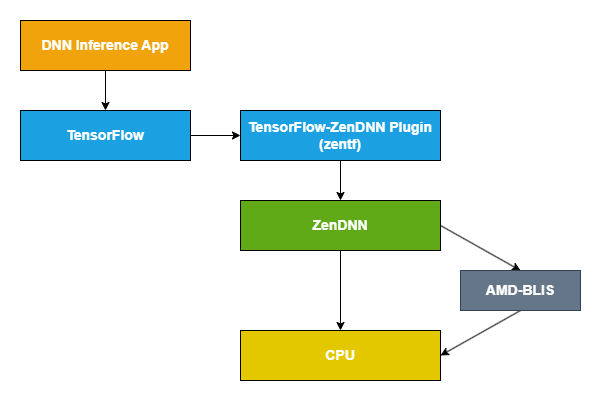

# TensorFlow-ZenDNN Plug-in For AMD CPUs

__The latest ZenDNN Plugin for TensorFlow* (zentf) 2.21.0.0 is here!__

The ZenDNN plugin for TensorFlow is called zentf.

The zentf 2.21.0.0 plugin works seamlessly with TensorFlow version 2.21.0, offering a high-performance experience for deep learning on AMD EPYC™ platforms.

> **Versioning:** Starting with this release, zentf follows TensorFlow's version numbering. The version format is `TF_MAJOR.TF_MINOR.TF_PATCH.PLUGIN_PATCH` (e.g., `2.21.0.0` targets TensorFlow 2.21.0).

## Support

We welcome feedback, suggestions, and bug reports. Should you have any of these, please kindly file an issue on the ZenDNN Plugin for TensorFlow Github page: https://github.com/amd/ZenDNN-tensorflow-plugin/issues

## License

AMD copyrighted code in ZenDNN is subject to the [Apache-2.0, MIT, or BSD-3-Clause](https://github.com/amd/ZenDNN-tensorflow-plugin/blob/main/LICENSE) licenses; consult the source code file headers for the applicable license. Third party copyrighted code in ZenDNN is subject to the licenses set forth in the source code file headers of such code.

## Overview

The following is a high-level block diagram for the zentf package which utilizes [ZenDNN](https://github.com/amd/ZenDNN) as the core inference library:



This file shows how to implement, build, install and run a TensorFlow-ZenDNN plug-in for AMD CPUs.

## Supported OS
Refer to the [support matrix](https://www.amd.com/en/developer/zendnn.html#getting-started) for the list of supported operating system.

## Supported User Interfaces
* Python
* Java
* C++

## Prerequisites

| Tools/Frameworks | Version |
| :--------------: | :-----: |
| [Bazel](https://docs.bazel.build/versions/master/install-ubuntu.html) | 7.7.0 |
| Git | >=1.8 |
| Python | >=3.10 and <=3.13 |
| [TensorFlow](https://www.tensorflow.org/) | 2.21.0 |

# Installation Guide

This section explains how to use the Python interface. For Java and C++ interfaces, kindly look inside the respective folders within the [scripts](./scripts/) folder. To build the C++ package from source, see the [C++ Build from Source Guide](./scripts/c++/BUILD_FROM_SOURCE.md).
> **Note:** zentf is build compatible with TensorFlow versions 2.16.0 through 2.21.0. The `./configure` script auto-detects the installed TensorFlow version and applies the matching build configuration.

## Prerequisite
* Create conda environment and activate it.
  ```
  conda create -n tf-v2.21.0-zentf-v2.21.0.0-env python=3.10 -y
  conda activate tf-v2.21.0-zentf-v2.21.0.0-env
  ```
  > **Note:** Python 3.10 used here for example.
* Install TensorFlow v2.21.0
  ```
  pip install tensorflow==2.21.0
  ```
## Build and install from source.
### 1. Clone the repository
```
git clone https://github.com/amd/ZenDNN-tensorflow-plugin.git
cd ZenDNN-tensorflow-plugin/
```
The repository defaults to main branch, to build the version 2.21.0.0 checkout the v2.21.0.0 branch.
```
git checkout v2.21.0.0
```

### 2. Configuring &  Building the TensorFlow-ZenDNN Plug-in using script.

>**Notes:**
>* ```export ZENDNNL_MANYLINUX_BUILD=1``` is needed for build from source for RHEL/FEDORA/Almalinux/CentOS OS families.
>* Configure & Build Tensorflow-ZenDNN Plug-in manually by following the steps [3-6].

```
The setup script will configure & build and install Tensorflow-ZenDNN Plug-in. It will also set the necessary environment variables of ZenDNN execution. However, these variables should be verified empirically.

ZenDNN-tensorflow-plugin$ source scripts/zentf_setup.sh
```

### 3. Configure the build options:
```
ZenDNN-tensorflow-plugin$ ./configure
Please specify the location of python. [Default is /home/user/anaconda3/envs/zentf-env/bin/python]:

Found possible Python library paths:
  /home/user/anaconda3/envs/zentf-env/lib/python3.10/site-packages
Please input the desired Python library path to use.  Default is [/home/user/anaconda3/envs/zentf-env/lib/python3.10/site-packages]

Configuring build for TensorFlow 2.21 (config: tf_2.21)
  Copied workspace.bzl -> tensorflow_plugin/workspace.bzl
  Copied WORKSPACE -> WORKSPACE
  Copied build_config_util.bzl -> tensorflow_plugin/src/amd_cpu/util/build_config.bzl
  Copied BUILD.tpl -> third_party/tf_dependency/BUILD.tpl
  Set .bazelversion to 7.7.0
Version configuration complete for TensorFlow 2.21

You have bazel 7.7.0 installed.
Do you wish to build TensorFlow plug-in with MPI support? [y/N]: 
No MPI support will be enabled for TensorFlow plug-in.

Please specify optimization flags to use during compilation when bazel option "--config=opt" is specified [Default is -march=native -Wno-sign-compare]: 


Configuration finished
```

### 4. Build the TensorFlow-ZenDNN Plug-in:
```
bazel clean --expunge

bazel build  -c opt //tensorflow_plugin/tools/pip_package:build_pip_package --verbose_failures --copt=-Wall --copt=-Werror --spawn_strategy=standalone
```

### 5. Generate python wheel file:
```
bazel-bin/tensorflow_plugin/tools/pip_package/build_pip_package .
```
>**Note:** It will generate and save python wheel file for TensorFlow-ZenDNN Plug-in into the current directory (i.e., ZenDNN-tensorflow-plugin/).

### 6. Install wheel file using pip:
```
pip install zentf-2.21.0.0-cp310-cp310-linux_x86_64.whl
```

**The build and installation from source is done!**

## Enable TensorFlow-ZenDNN Plug-in:
```
export TF_ENABLE_ZENDNN_OPTS=1
export TF_ENABLE_ONEDNN_OPTS=0
```
>**Note:** To disable ZenDNN optimizations in your inference execution, you can set the corresponding ZenDNN environment variable `export TF_ENABLE_ZENDNN_OPTS=0`

## Execute sample kernel:
```
ZenDNN-tensorflow-plugin$ python tests/softmax.py
WARNING: All log messages before absl::InitializeLog() is called are written to STDERR
I0000 00:00:1781633395.658366 1330299 port.cc:180] ZenDNN custom operations are on. You may see slightly different numerical results due to floating-point round-off errors from different computation orders. To turn them off, set the environment variable `TF_ENABLE_ZENDNN_OPTS=0`.
I0000 00:00:1781633395.658783 1330299 cudart_stub.cc:31] Could not find cuda drivers on your machine, GPU will not be used.
I0000 00:00:1781633395.708043 1330299 cpu_feature_guard.cc:227] This TensorFlow binary is optimized to use available CPU instructions in performance-critical operations.
To enable the following instructions: AVX2 AVX512F AVX512_VNNI AVX512_BF16 FMA, in other operations, rebuild TensorFlow with the appropriate compiler flags.
WARNING: All log messages before absl::InitializeLog() is called are written to STDERR
I0000 00:00:1781633399.131991 1330299 port.cc:180] ZenDNN custom operations are on. You may see slightly different numerical results due to floating-point round-off errors from different computation orders. To turn them off, set the environment variable `TF_ENABLE_ZENDNN_OPTS=0`.
I0000 00:00:1781633399.133921 1330299 cudart_stub.cc:31] Could not find cuda drivers on your machine, GPU will not be used.
E0000 00:00:1781633399.483406 1330299 cuda_platform.cc:52] failed call to cuInit: INTERNAL: CUDA error: Failed call to cuInit: UNKNOWN ERROR (303)
Tensor("random_normal:0", shape=(10,), dtype=float32)
I0000 00:00:1781633400.194750 1330299 direct_session.cc:382] Device mapping: no known devices.
I0000 00:00:1781633400.195106 1330299 mlir_graph_optimization_pass.cc:437] MLIR V1 optimization pass is not enabled
random_normal/RandomStandardNormal: (RandomStandardNormal): /job:localhost/replica:0/task:0/device:CPU:0
I0000 00:00:1781633400.197756 1330299 placer.cc:162] random_normal/RandomStandardNormal: (RandomStandardNormal): /job:localhost/replica:0/task:0/device:CPU:0
random_normal/mul: (Mul): /job:localhost/replica:0/task:0/device:CPU:0
I0000 00:00:1781633400.197878 1330299 placer.cc:162] random_normal/mul: (Mul): /job:localhost/replica:0/task:0/device:CPU:0
random_normal: (AddV2): /job:localhost/replica:0/task:0/device:CPU:0
I0000 00:00:1781633400.197954 1330299 placer.cc:162] random_normal: (AddV2): /job:localhost/replica:0/task:0/device:CPU:0
Softmax: (Softmax): /job:localhost/replica:0/task:0/device:CPU:0
I0000 00:00:1781633400.198030 1330299 placer.cc:162] Softmax: (Softmax): /job:localhost/replica:0/task:0/device:CPU:0
random_normal/shape: (Const): /job:localhost/replica:0/task:0/device:CPU:0
I0000 00:00:1781633400.198105 1330299 placer.cc:162] random_normal/shape: (Const): /job:localhost/replica:0/task:0/device:CPU:0
random_normal/mean: (Const): /job:localhost/replica:0/task:0/device:CPU:0
I0000 00:00:1781633400.198179 1330299 placer.cc:162] random_normal/mean: (Const): /job:localhost/replica:0/task:0/device:CPU:0
random_normal/stddev: (Const): /job:localhost/replica:0/task:0/device:CPU:0
I0000 00:00:1781633400.198259 1330299 placer.cc:162] random_normal/stddev: (Const): /job:localhost/replica:0/task:0/device:CPU:0
I0000 00:00:1781633400.198792 1330299 custom_graph_optimizer_registry.cc:117] Plugin optimizer for device_type CPU is enabled.
[0.05660784 0.09040404 0.03201076 0.11204024 0.2344563  0.162052
 0.09466095 0.11205972 0.0752109  0.03049729]
```

# Resources
* [TensorFlow's Pluggable Device blog](https://blog.tensorflow.org/2021/06/pluggabledevice-device-plugins-for-TensorFlow.html)
* [AMD-TensorFlow blog](https://blog.tensorflow.org/2023/03/enabling-optimal-inference-performance-on-amd-epyc-processors-with-the-zendnn-library.html)

# Performance tuning and Benchmarking
* zentf v2.21.0.0 is supported with ZenDNN v6.0.0. For detailed performance tuning guidelines, refer to the [Performance Tuning](https://docs.amd.com/r/en-US/57300-ZenDNN-user-guide/Performance-Tuning) section of the ZenDNN user guide.

# Additional Utilities:

## zentf attributes:
To check the version of zentf use the following command:

```bash
python -c 'import zentf; print(zentf.__version__)'
```

To check the build config of zentf use the following command:
```bash
python -c 'import zentf; print(*zentf.__config__.split("\n"), sep="\n")'
```
